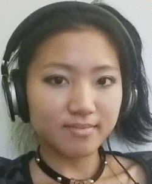
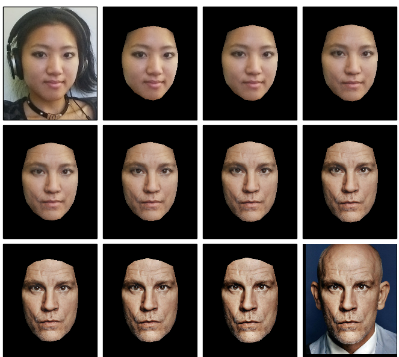

# Face Morpher

Warp, average and morph human faces!

## Morph between 2 images:
Must supply path to source and destination image.

    python transformer/morpher.py --src=<src_imgpath> --dest=<dest_imgpath>

All options listed in `morpher.py` (pasted below):
```
Morph from source to destination face

Usage:
  morpher.py --src=<src_path> --dest=<dest_path>
            [--width=<width>] [--height=<height>]
            [--num=<num_frames>] [--fps=<frames_per_second>]
            [--out_frames=<folder>] [--out_video=<filename>]
            [--plot] [--blend] [--data=<classifiers_folder>]

Options:
  -h, --help              Show this screen.
  --src=<src_imgpath>     Filepath to source image (.jpg, .jpeg, .png)
  --dest=<dest_path>      Filepath to destination image (.jpg, .jpeg, .png)
  --width=<width>         Custom width of the images/video [default: 500]
  --height=<height>       Custom height of the images/video [default: 600]
  --num=<num_frames>      Number of morph frames [default: 20]
  --fps=<fps>             Number frames per second for the video [default: 10]
  --out_frames=<folder>   Folder path to save all image frames [default: None]
  --out_video=<filename>  Filename to save a video [default: None]
  --plot                  Flag to plot images [default: False]
  --blend                 Flag to blend images [default: False]
  --data=<folder>         Folder to .xmls for classifiers [default: data]
  --version               Show version.
```

## Average faces from all images in a folder:

    python transformer/averager.py --images=<images_folder> [--blend]

## Steps (transformer folder)

#### 1. Locator

 * Locates face points (using stasm)
 * For a different locator, return an array of (x, y) control face points

#### 2. Aligner

  * Align faces by resizing, centering and cropping to given size

#### 3. Warper

  * Given 2 images and its face points, warp one image to the other
  * Triangulates face points
  * Affine transforms each triangle with bilinear interpolation

#### 4a. Morpher
  
  * Morph between 2 images

#### 4b. Averager

  * Average faces from 2 or more images

#### Blender
Optional blending of warped image:

  * Weighted average
  * Alpha feathering
  * Poisson blend

## Example: [Being John Malkovich](http://www.rottentomatoes.com/m/being_john_malkovich)
##### Create a morphing video between the 2 images:
`> python transformer/morpher.py --src=alyssa.jpg --dest=john_malkovich.jpg`    
`--out_video=out.avi`

(out.avi played and recorded as gif)



##### Save the frames to a folder:    
`> python transformer/morpher.py --src=alyssa.jpg --dest=john_malkovich.jpg`    
`--out_frames=out_folder --num=30`

##### Plot the frames
`> python transformer/morpher.py --src=alyssa.jpg --dest=john_malkovich.jpg`    
`--num=12 --plot`



## Documentation (requires sphinx)

    ./make_docs.sh

## License
[MIT](http://alyssaq.github.io/mit-license/)